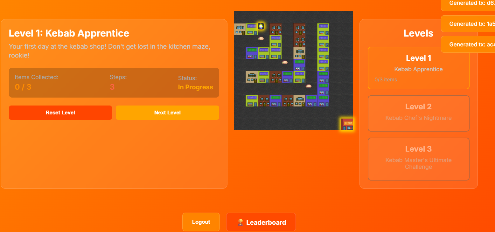
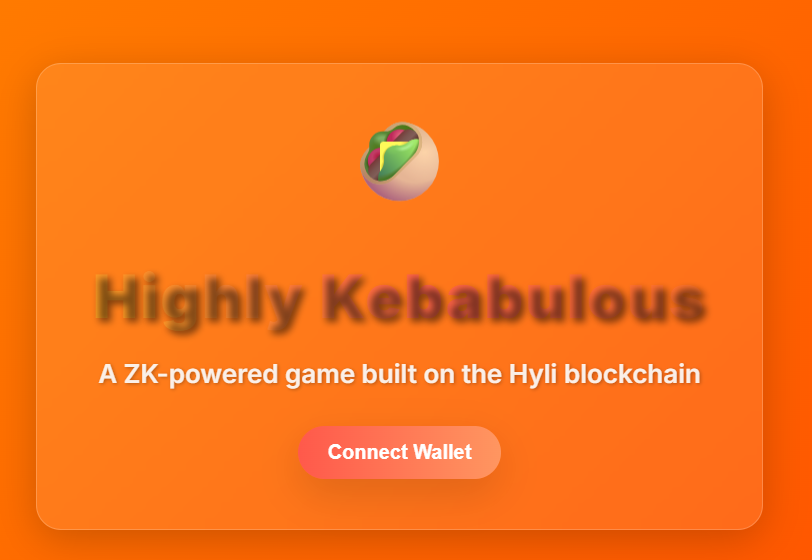

# Highly Kebabulous

This is a quest for finding all the kebabs in town - verifiably, and with the least amount of steps.

## Used components

- [Hyli](https://hyli.org/) L1 blockchain
- Noir UltraHonk ZK proofs
- Horizen / ZkVerify ZK verification network

## Functionality

### Login

The game uses Hyli identity to login.

### The game

Each step in the game generates a Hyli blob transaction and starts generating a ZK proof for the action. The exact steps remain private, but the proof is verified by the Hyli and Horizen networks.

You can monitor Hyli transactions and proofs at https://explorer.hyli.org/ (switch the network to localhost).

### Leaderboard

The best kebab hunters are recorded in the leaderboard.

## Setup

### Run a Hyli node

1. Clone the scaffold project at https://github.com/hyli-org/app-scaffold
1. Enter the `app-scaffold` folder
1. Run the needed Docker containers with `docker-compose up -d`

This will start a local Hyli node and blockchain, an indexer and other required components.

### Run the frontend

1. Clone this repository
1. Enter the frontend folder: `cd zkhack-portal`
1. Install dependencies: `yarn`
1. Run the frontend: `yarn dev`

You can now go to http://localhost:3000/ and login with credentials:
- Username: `hyli`
- Password: `hylisecure`

## Future development

The game is not complete. Certain functionalities are not fully implemented and more work is required.

### Horizen verification issues

Unfortunately, we did not get the Horizen proof verification working. Our Solidity verifier contract is written in `solidity` folder in this project and deployed at https://sepolia.basescan.org/address/0xcab2ca58a30d437cce7204e015c86cfbd2cb3d07 . The verification code is in GitHub branch `feat/horizen`.

### Leaderboard

The leaderboard data is currently not real. The state should be stored either in the Hyli blockchain or to an external blockchain.

### Noir validation

The used Noir circuit verifies only part of the game rules.